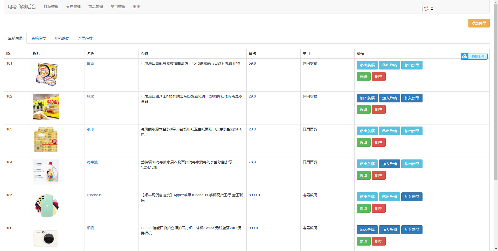
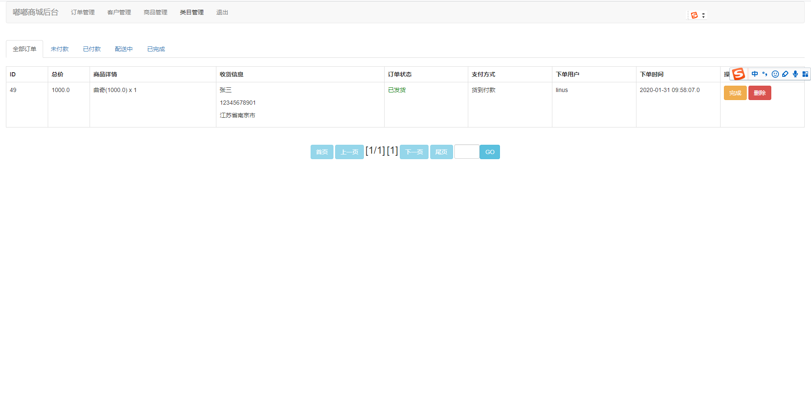
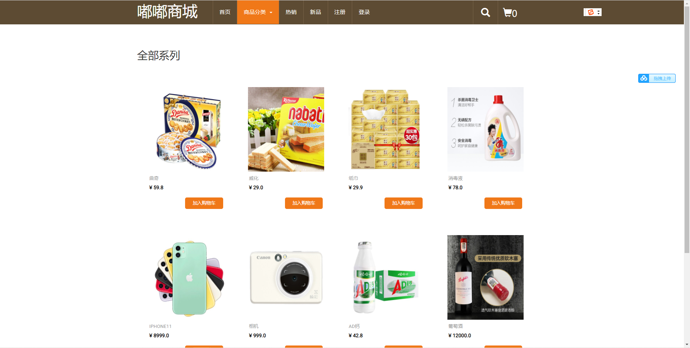
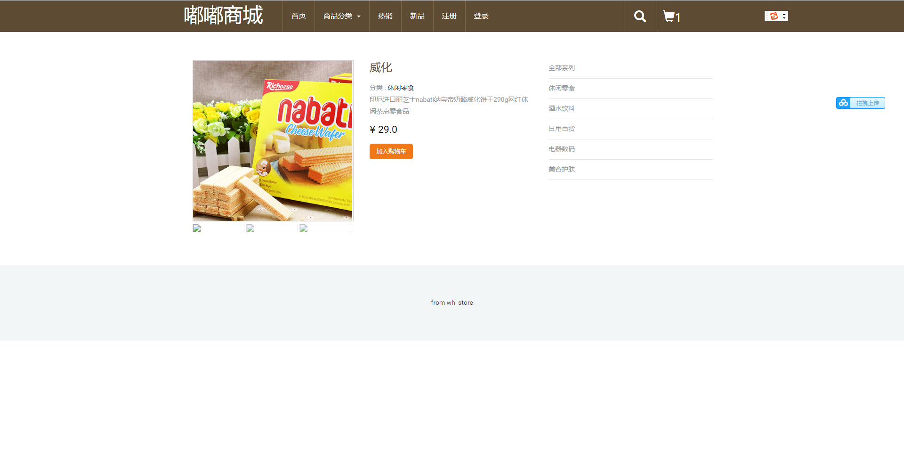
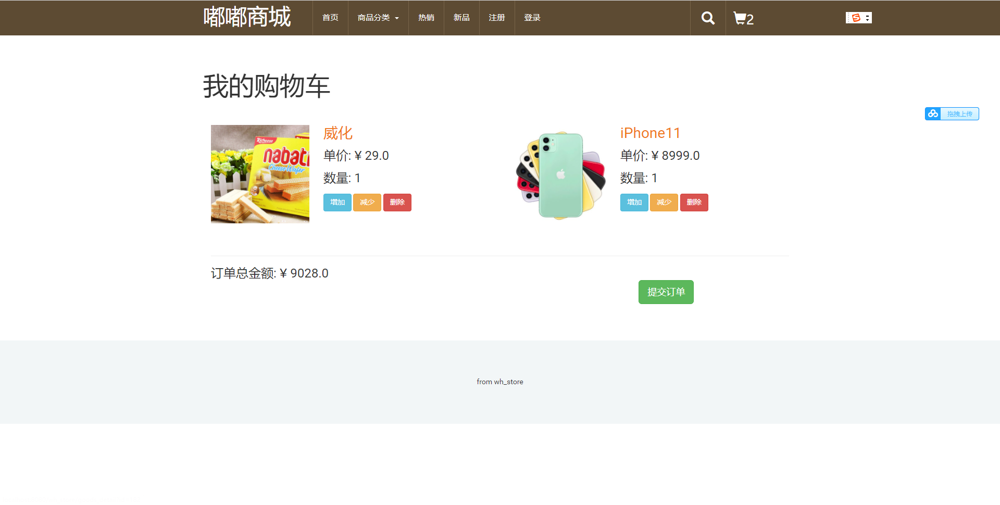

# 基于SSM的网上商城系统

#### 介绍
网上商城系统，是一款基于jsp+servlet架构的商城系统，涉及了很多基础技术，比如监听器、过滤器、登录验证等，是一款javaEE的典型商城系统，非常适合小白学习或者毕业作品，主要分两端Web端与管理后端，代码规范整洁，技术选型也非常经典，合适初学java编程者学习以及计算机专业学生。

#### 软件架构
前端：html | jquery | bootstrap  
后端：spring | springmvc | mybatis  
环境：jdk1.8 | maven | mysql | tomcat      

#### 功能介绍

##### 【功能详述】 

- 商品列表

    

- 订单列表

    

- 商品分类

    

- 商品详情

    

- 购物车

    

#### 使用说明
1. 创建数据库，执行数据库脚本  
2. 修改jdbc数据库连接参数  
3. 下载安装maven依赖jar  
4. 启动SpringBoot启动类  

#### 后端管理

数据库超级管理员： admin  admin   

普通用户可以新建  

前台商品访问地址：http://localhost:8080/wh_store/index  

后端管理员访问地址：http://localhost:8080/wh_store/admin/index.jsp（注意必须用admin超级
管理员登录，才能进入后台。如果不会，可以查看产品演示小视频）